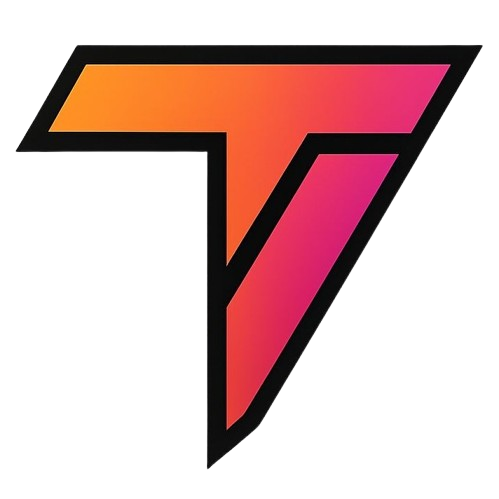
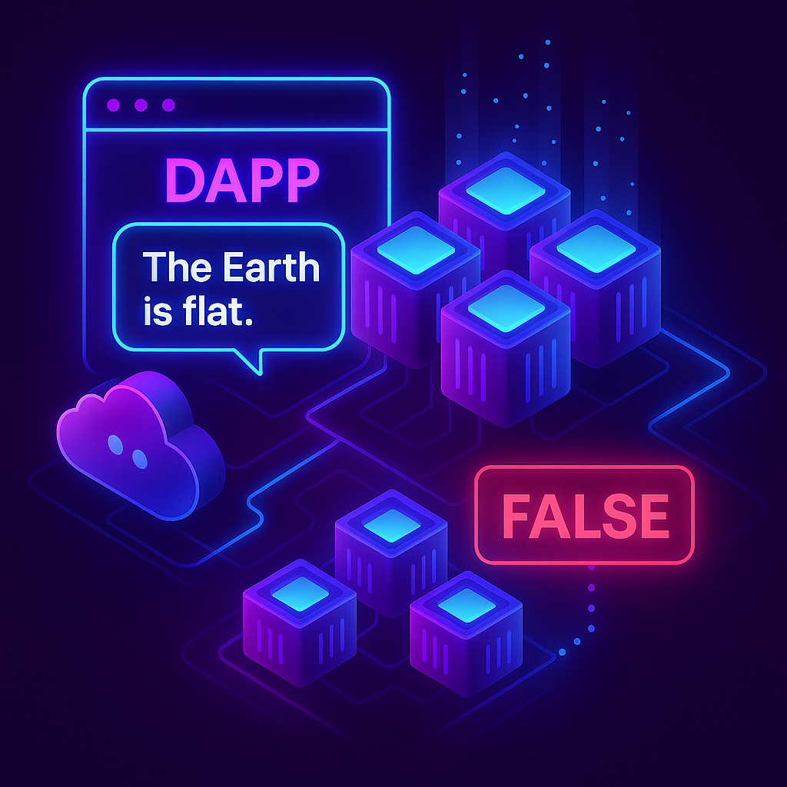
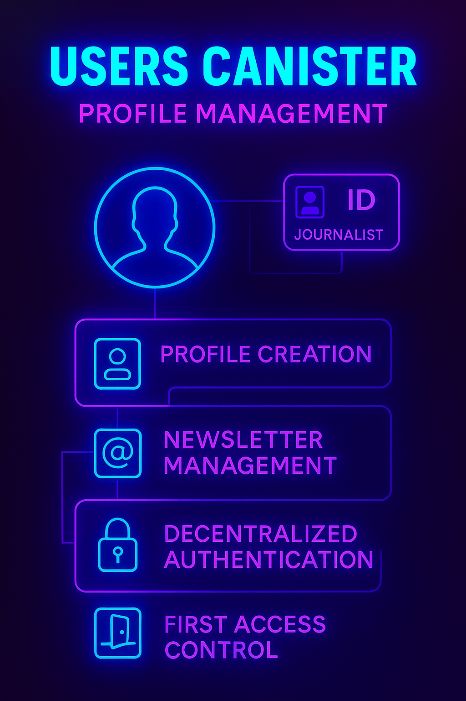
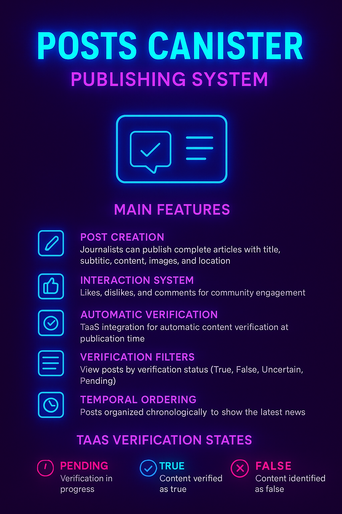
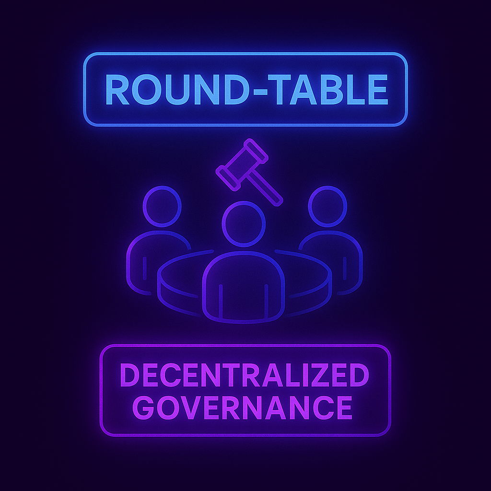
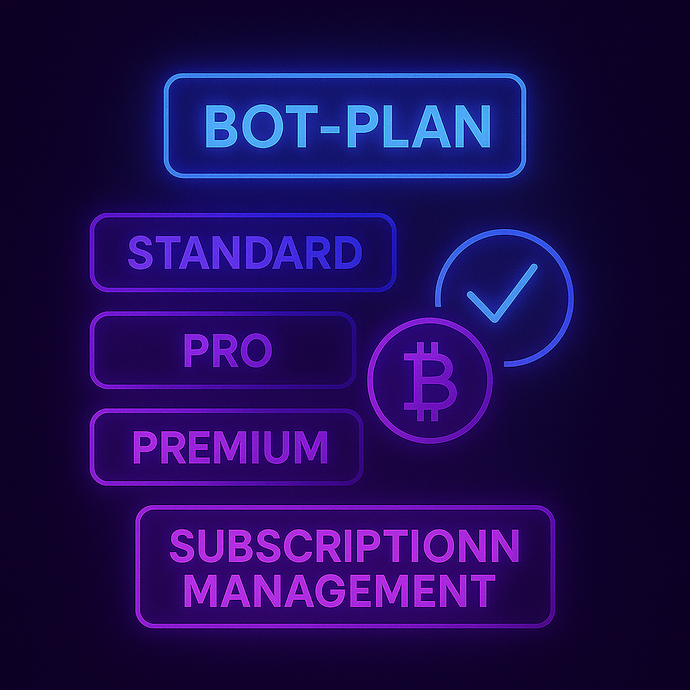
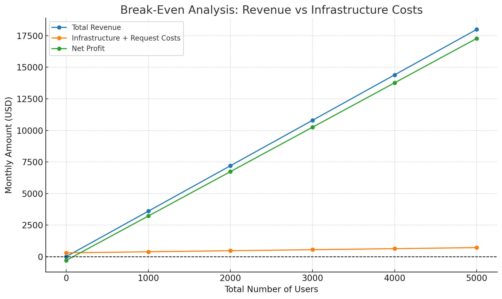

# Truth-as-a-Service | TaaS

<p align="center">
  
  
</p>

## Project Summary

[TaaS](https://5vhpn-tyaaa-aaaaf-qbija-cai.icp0.io/) is a decentralized protocol built on the [Internet Computer Protocol (ICP)](https://internetcomputer.org/) that provides fast, auditable fact verification on-chain.

It accepts user claims, sources information from the web, processes reasoning through LLMs *(AI Track)*, aggregates community input, and stores tamper-proof verdicts.

<p align="center">
  
</p>

It's designed to combat misinformation by creating a transparent, community-driven system for verifying claims and storing tamper-proof verdicts.

## Developers
- [Gabriel Farias](https://www.linkedin.com/in/gabriel-farias-alves/)
- [Kaiane Cordeiro](https://www.linkedin.com/in/kaiane-souza/)
- [Marco A. Rizzi](https://www.linkedin.com/in/marco-a-rizzi/)
- [Marcos Teixeira](https://www.linkedin.com/in/marcos-teixeira-37676a24a/)

## Table of Contents
- [0. Get Started](#0-get-started)
  - [0.1 Prerequisites](#01-prerequisites)
  - [0.2 Installation](#02-installation)
  - [0.3 Available Commands](#03-available-commands)
  - [0.4 Next Steps](#04-next-steps)
- [1. Business Vision](#1-business-vision)
  - [1.1 TaaS as a Trusted News Platform](#11-taas-as-a-trusted-news-platform)
  - [1.2 Empowering Journalists and Freedom of Expression](#12-empowering-journalists-and-freedom-of-expression)
  - [1.3 Core Pillars: Security, Accuracy, Expression, and Support](#13-core-pillars-security-accuracy-expression-and-support)
  - [1.4 Brazil: National Context and Opportunities](#14-brazil-national-context-and-opportunities)
  - [1.5 Mission and Long-Term Vision](#15-mission-and-long-term-vision)
- [2. Architecture Overview](#2-architecture-overview)
  - [2.1 User](#21-users-canister)
  - [2.2 Posts](#22-posts-canister)
  - [2.3 Search News](#23-search-news)
  - [2.4 Round Table](#24-round-table)
  - [2.5 Bot Plan](#25-bot-plan)
- [ 3. The Journey of a Query](#3-the-journey-of-a-query)
  - [3.1 User Interaction and Access Management](#31-user-interaction-and-access-management)
  - [3.2 The Core Verification Process (Core Loop)](#32-the-core-verification-process-core-loop)
  - [3.3 The Hybrid Bridge: Web3 to Web2 Interaction](#33-the-hybrid-bridge-web3-to-web2-interaction-ipv6--ipv4-proxy)
- [4. Financial Analysis](#4-financial-analysis)
  - [4.1 Subscription Plans](#41-subscription-plans)
  - [4.2. Core Financial Assumptions](#42-core-financial-assumptions)
  - [4.3 Per-User Profitability Analysis](#43-per-user-profitability-analysis)
  - [4.4 Sustainability Model: Subsidizing the Network](#44-sustainability-model-subsidizing-the-network)
  - [4.5 Case Study: Path to Profitability](#45-case-study-path-to-profitability)
  - [4.6 Data for Visualization](#46-data-for-visualization)
  - [4.7 Finantial Conclusion](#47-finantial-conclusion)

## 0. Get Started
Follow these steps to set up and run the TaaS project on Internet Computer Protocol (ICP).

### 0.1 Prerequisites

Before running the project, make sure you have the following installed:

- [DFX](https://internetcomputer.org/docs/current/developer-docs/setup/install/) - The DFINITY command-line execution environment
- [Mops](https://mops.one/) - Package manager for Motoko
- [Node.js](https://nodejs.org/) (version 16 or higher)


### 0.2 Installation

1. **Clone the repository**
   ```bash
   git clone https://github.com/Txrmarcos/TaaS.git
   cd taas
   ```

2. **Install backend dependencies (Mops packages)**
   ```bash
   mops install
   ```

3. **Install frontend dependencies**
   ```bash
   cd frontend
   npm install
   cd ..
   ```

4. **Start the local Internet Computer replica**
   ```bash
   dfx start --background
   ```

5. **Deploy the canisters**
   ```bash
   dfx deploy
   ```

## Running the Project

1. **Start the development server**
   ```bash
   dfx start
   ```

2. **In a new terminal, deploy your canisters**
   ```bash
   dfx deploy --network local
   ```

3. **Start the frontend development server**
   ```bash
   cd frontend
   npm start
   ```

4. **Access the application**
   - Frontend: `http://localhost:3000`
   - Candid Interface: `http://localhost:4943/?canisterId={canister-id}`

### 0.3 Available Commands

#### DFX Commands
- `dfx start` - Start the local Internet Computer replica
- `dfx start --clean` - Start with a clean state (removes previous data)
- `dfx start --background` - Start the replica in background mode
- `dfx stop` - Stop the local ICP replica
- `dfx build` - Compile all canisters without deploying
- `dfx build <canister-name>` - Build a specific canister
- `dfx deploy` - Build and deploy all canisters to local network
- `dfx deploy --network ic` - Deploy to the main Internet Computer network
- `dfx deploy <canister-name>` - Deploy a specific canister
- `dfx canister status` - Check the status of all canisters
- `dfx canister call <canister-name> <method>` - Call a canister method
- `dfx identity list` - List available identities
- `dfx identity use <identity-name>` - Switch to a different identity

#### Mops Commands
- `mops install` - Install all Motoko packages from mops.toml
- `mops add <package-name>` - Add a new package dependency
- `mops test` - Run tests (if configured)
- `mops sources` - Show package sources and versions

#### Frontend Commands
- `npm install` - Install frontend dependencies
- `npm start` - Start the development server
- `npm run build` - Build the frontend for production

#### Development Workflow
1. **Build Backend**: `dfx build` - Compile your canisters
2. **Deploy Backend**: `dfx deploy` - Deploy to local replica
3. **Start Frontend**: `cd frontend && npm start` - Run frontend dev server
4. **Test**: Access frontend at `http://localhost:3000`
5. **Iterate**: Make changes and repeat the process

### 0.4 Next Steps

After successfully running the project:
1. Explore the candid interface to interact with the canisters
2. Check the project documentation for API details
3. Review the source code to understand the implementation
4. Consider contributing to the project development

## 1. Business Vision
Truth-as-a-Service (TaaS) acts as a decentralized, auditable fact-checking engine that removes uncertainty around data veracity. It offers near-instant verification of factual claims using only audited, trusted sources and stores its results immutably on-chain. This makes TaaS an invaluable middleware service for applications needing trustworthy, verifiable data.

### 1.1 Leveraging TaaS in the ICP Ecosystem

>How dApps Benefit from TaaS?

Any decentralized application (dApp) operating on the Internet Computer (ICP) can seamlessly incorporate TaaS to:

1. **Validate User-Generated Claims**

   * Social platforms, content aggregators, or Q\&A forums can use TaaS to verify factual claims made by users in real-time.

2. **Power Smart Contracts with Truth Signals**

   * DeFi protocols, DAOs, and prediction markets can make automated decisions (e.g., releasing funds or executing votes) based on on-chain TaaS verdicts.

3. **Enhance Reputation Systems**

   * Platforms with rating, trust, or identity systems can integrate TaaS to ensure users aren’t rewarded for misinformation.

4. **Enable Trustable ESG or Compliance Reporting**

   * Enterprises building ESG dashboards or compliance-focused dApps can use TaaS to back reports with verified public data.

### 1.2 Integration Simplicity
The current TaaS backend is designed for streamlined integration:

* **Points of Truth**: dApps query the `bot-plan` for subscription and `search-news`canister for factual verifications.
* **Auditability by Design**: Every verdict includes hash, timestamp, and source metadata, allowing dApps to offer users proof of integrity.

### 1.3 Agent-to-Agent Model
TaaS enables an "agent communicating with agent" paradigm, where:

* Apps don’t rely on centralized APIs
* Data authenticity is provable and independent
* Decisions across multiple dApps can coordinate based on shared, trustless facts

### 1.4 Shape future in a trustless, scalable way
By integrating TaaS, developers reduce misinformation risks, enhance automation with verified data, and differentiate their products with built-in credibility. TaaS is positioned to become a core verification primitive within the ICP ecosystem.

In a decentralized world, trust must be programmable. TaaS (Trust as a Service) brings a truth layer to ICP, allowing applications to be built on verified and auditable information.

This trust network is organic, as users themselves feed it with new proposals, and the community democratically judges which sources are reliable. Imagine a scenario where the global community chooses the most trustworthy sources to generate a verdict on an LLM's answers. This is how we are building a network with organic, decentralized, and democratic growth.

The modular and low-friction integration model of TaaS ensures that any dApp—from finance and governance to content—can incorporate this truth as a service.

## 2. Architecture Overview


TaaS has evolved from a simple fact-checking system into a complete decentralized news platform built on the Internet Computer Protocol (ICP). The platform provides a secure environment for journalists with freedom of expression limitations, offering security, voice, and resources through blockchain technology.
Key Features:

**Journalist Protection**: Decentralized environment that protects identity and ensures freedom of expression
Automatic Verification: TaaS integration for real-time content verification of published articles
Community Governance: Democratic system for information source curation
Decentralized Monetization: Subscription system using cryptocurrencies
Censorship Resistance: Decentralized infrastructure that prevents blocking and censorship

2. Platform Architecture
The architecture consists of 5 main canisters, each responsible for a specific platform functionality:


<p align="center">
  
</p>

### 2.1 Users Canister - Profile Management

The users-canister is responsible for complete user management on the platform, including journalists and readers.

<p align="center">
  
</p>

**Main Features**:

Profile Creation: Registration of new users with basic information (username, bio, profile picture)
Journalist Registration: Special system for journalist accreditation on the platform
Newsletter Management: Control of created newsletters and user subscriptions
Decentralized Authentication: Use of Principal IDs for unique and secure identification
First Access Control: System for onboarding new users

**User Types**:

Readers: Can read, comment, like posts and subscribe to newsletters
Journalists: In addition to reader functionalities, can create posts, newsletters and publish verified content

### 2.2 Posts Canister - Publishing System
The posts-canister manages all editorial content on the platform, including posts, comments and the integrated verification system.
<p align="center">
  
</p>

**Main Features**:

**Post Creation**: Journalists can publish complete articles with title, subtitle, content, images and location
Interaction System: Likes, dislikes and comments for community engagement
Automatic Verification: TaaS integration for automatic content verification at publication time
Verification Filters: View posts by verification status (True, False, Uncertain, Pending)
Temporal Ordering: Posts organized chronologically to show the latest news
Re-verification: Ability to request new verification of already published content

TaaS Verification States:

##### Pending: `Verification in progress`
##### True: `Content verified as true`
##### False: `Content identified as false`
##### Uncertain: `Inconclusive verification`
##### Error: `Error in verification process`

### 2.3 Search News

The ``search-news`` canister is the central orchestrator of the verification process. Its main responsibilities are:

<p align="center">
  
</p>

-   **Receive Queries:** Acts as the entry point for claims (prompts) submitted by users or other dApps.
-   **Access Control:** Before processing a query, it checks with the ``bot-plan`` canister to see if the user has available requests in their subscription plan.
-   **Source Curation:** Queries the ``round-table`` canister to get the list of trusted and community-approved news sources. The information search is restricted to these sources.
-   **LLM Interaction:** Prepares the search context based on the approved sources and sends it to the IPC's LLM canister, which uses a language model to process the information and synthesize a logical conclusion.
-   **Bridge to Web2:** To access news sources operating on *IPv4*, search-news sends an *IPv6* request to a Proxy (e.g., AWS Lambda). The proxy translates the request to *IPv4*, collects the data from the source (e.g., newsapi.org), and returns it to the canister.
-   **Verdict Delivery:** Consolidates the result from the LLM analysis and sends it back to the FrontEnd or the requesting dApp as a final and auditable Verdict.
-   **Truth Oracle:** Being modular, any dApp can call search-news directly to integrate a fact-checking system, positioning TaaS as a trust infrastructure layer for Web3.

### 2.4 Round Table

The ``round-table`` is the canister responsible for the decentralized governance of information sources. Its function is to ensure that the TaaS knowledge base is reliable and curated by the community.

<p align="center">
  
</p>

-   **Source Governance:** Community members can create proposals and conduct voting (Proposals and Voting) to add or remove data sources (news sites, APIs, etc.).
-   **On-chain Registry:** Once a source is democratically approved, it is registered on-chain in a transparent and immutable manner.
-   **Provision of Trusted Sources:** The canister provides the list of approved sources (onchain-Truth) to the search-news canister, ensuring that only data from validated sources are used in the verification process.

### 2.5 Bot Plan

The ``bot-plan`` is the canister that manages user subscriptions, plans, and access to TaaS services.

<p align="center">
  
</p>

-   **Plan Management:** Upon logging in, the user is assigned a default plan (Standard). They can interact with the ``bot-plan`` to upgrade to higher-tier plans (Pro, Premium), which offer more requests or features.
-   **Usage Validation:** When ``search-news`` receives a request, it queries the bot-plan to validate the user's usage quota (do you have requests left?). The ``bot-plan`` then authorizes or denies the process continuation based on the active plan and consumption to date.
-   **Payment Integration:** The system uses the on-chain Ledger so that users can convert ICP tokens to ``ckBTC`` (a "wrapped" Bitcoin on the ICP network), which is the currency used for payment and plan exchanges within the application.

## 3. The Journey of a Query

The flow below describes the step-by-step interaction between the components.

### 3.1 User Interaction and Access Management

The flow begins with the User, who interacts with the platform via the FrontEnd.

-   **Authentication and Plans:** The user logs in and is assigned a Standard plan by default. They can interact with the bot-plan canister to manage their subscription.
-   **Fund Management:** Through the on-chain Ledger, the user can convert *ICP* tokens to *ckBTC* (a "wrapped" Bitcoin on the ICP network), which is used for in-app payments.

### 3.2 The Core Verification Process (Core Loop)

The user submits a claim ("prompt") through the FrontEnd to ``search-news``, which orchestrates the verification.

-   **Usage Control (``bot-plan`` ↔ ``search-news``):**
    -   Before processing, ``search-news`` asks ``bot-plan``: do you have requests left?.
    -   The ``bot-plan`` validates the usage quota, authorizing or denying continuation.
-   **Source Curation (Round-Table → ``search-news``):**
    -   ``search-news`` fetches the list of community-approved sources (onchain-Truth) from the Round-Table.
    -   This ensures the knowledge base is decentralized and trustworthy.
-   **Analysis and Reasoning (``search-news`` ↔ LLM):**
    -   With the approved sources, ``search-news`` prepares the context and sends it to the LLM canister.
    -   The LLM processes the information and synthesizes a logical conclusion.
-   **Verdict Delivery (``search-news`` → FrontEnd):**
    -   ``search-news`` consolidates the final result and sends it back to the FrontEnd as a Verdict.

### 3.3 The Hybrid Bridge: Web3 to Web2 Interaction (IPv6 → IPv4 Proxy)

A crucial part of the architecture is how TaaS, running in a Web3 environment, accesses Web2 data.

-   **The Challenge:** The ICP network natively operates on the IPv6 protocol. However, most news sources on the internet still operate on IPv4.
-   **The Solution:** To overcome this limitation, the search-news canister uses a proxy.
    1.  It sends an IPv6 request to a *Proxy* running in a Web2 environment (an AWS Lambda function).
    2.  The Proxy translates and executes an IPv4 request to the target news site (e.g., newsapi.org).
    3.  After collecting and parsing the information, the Proxy sends a notice back to search-news with the data.

This hybrid approach allows the on-chain system to safely and efficiently utilize the vast range of information available on the traditional web.

# 4. Financial Analysis

The analysis covers the project's revenue streams, cost structure, and the key metrics for achieving profitability and long-term sustainability.

The TaaS model is a "Freemium" service, featuring a free "Standard" plan supported by paid "Pro" and "Premium" subscribers. Revenue is generated from subscriptions, while the primary operational costs stem from the on-chain HTTP requests required for fact-checking and canister operations, which consume cycles on the Internet Computer.

The model is designed to be highly sustainable, with each paying user generating sufficient profit to cover their own operational costs and subsidize a significant number of free users, enabling scalable network growth.

## 4.1 Subscription Plans

| Plan     | Price (USD) | Requests per Day | Key Features                                    | Target Audience        |
|----------|-------------|------------------|-------------------------------------------------|------------------------|
| Standard | Free        | 5                | Basic fact-checking, Access to verified news   | General Users, Students|
| Pro      | $19.99      | 50               | Advanced fact-checking, Trend analysis, Detailed reports | Professionals, dApps   |
| Premium  | $99.99      | 500              | Full access, Custom API, 24/7 support, Custom analysis | Enterprises, Media Orgs |

**Payment:** Users pay for plans using ckBTC (a "wrapped" Bitcoin on ICP) or other integrated payment methods, with prices denominated in USD.

**ICP Price (Assumption):** For context, we assume an ICP price of $10.00 USD. This value is used for illustrative purposes regarding cycle costs, but all calculations are kept in USD for stability.

## 4.2. Core Financial Assumptions

### Operational Cost Structure

The TaaS platform operates with three main canisters, each contributing to the overall operational costs:

**Cost Components per Verification Request:**
- **HTTP Request (fact-checking):** $0.0005 USD per request to external APIs
- **Data Storage Operations:** $0.0001 USD per post storage and retrieval
- **Transaction Processing:** $0.00005 USD per internal transaction (likes, comments, user operations)
- **Total Cost per Verified Post:** $0.00055 USD

**Canister Infrastructure Costs:**
- **UsersCanister:** Handles user profiles, journalist registration, newsletter subscriptions
- **PostsCanister:** Manages posts, comments, likes/dislikes, and verification results
- **SearchNewsCanister:** Processes fact-checking requests and external API calls

**Revenue Allocation:** To ensure canisters remain funded, a portion of the revenue is immediately converted to cycles.
- **Allocation:** 50% of subscription revenue is allocated to the cycles wallet for operational costs
- **Remaining 50%** is considered Gross Profit before other business expenses

## 4.3 Per-User Profitability Analysis

This analysis determines the profitability of each paying subscriber, assuming they use their maximum daily request limit over a 30-day month.

### 4.3.1 Standard Plan (Cost Center)
- **Monthly Revenue:** $0
- **Max Monthly Requests:** 5 requests/day × 30 days = 150 requests
- **Max Monthly Cost:** 150 requests × $0.00055/request = $0.0825
- **Net Result:** A cost of $0.0825 per user per month

### 4.3.2 Pro Plan (Profit Center)
- **Monthly Revenue:** $19.99
- **Cycle Allocation (50%):** $9.995
- **Max Monthly Requests:** 50 requests/day × 30 days = 1,500 requests
- **Max Monthly Cost:** 1,500 requests × $0.00055/request = $0.825
- **Gross Profit (after request costs):** $19.99 (Revenue) - $0.825 (Cost) = $19.165

**Analysis:** Highly profitable. The allocated $9.995 in cycles easily covers the maximum possible cost of $0.825.

### 4.3.3 Premium Plan (Profit Center)
- **Monthly Revenue:** $99.99
- **Cycle Allocation (50%):** $49.995
- **Max Monthly Requests:** 500 requests/day × 30 days = 15,000 requests
- **Max Monthly Cost:** 15,000 requests × $0.00055/request = $8.25
- **Gross Profit (after request costs):** $99.99 (Revenue) - $8.25 (Cost) = $91.74

**Analysis:** Extremely profitable. A single Premium user generates a significant surplus.

## 4.4 Sustainability Model: Subsidizing the Network

The key to sustainability is understanding how many free users each paying user can support.

- **Cost to support 1 Standard User:** $0.0825 per month
- **Gross Profit from 1 Pro User:** $19.165 per month
- **Gross Profit from 1 Premium User:** $91.74 per month

### Sustainability Ratio:
- **Pro User:** $19.165 / $0.0825 ≈ 1 Pro user can support the request costs of ~232 Standard users
- **Premium User:** $91.74 / $0.0825 ≈ 1 Premium user can support the request costs of ~1,112 Standard users

This demonstrates a robust model where a small percentage of paying users can sustain a very large base of free users.

## 4.5 Canister Infrastructure Scaling

### Monthly Canister Operational Costs (Estimated)
- **UsersCanister:** $50 (profile storage, user management)
- **PostsCanister:** $150 (post storage, comments, interactions)
- **SearchNewsCanister:** $100 (verification processing, API calls)
- **Total Infrastructure:** $300 per month

### Break-Even Analysis for Infrastructure
With the typical freemium distribution (90% Standard, 8% Pro, 2% Premium):

| Total Users | Standard (90%) | Pro (8%) | Premium (2%) | Total Revenue | Infrastructure + Request Costs | Net Profit/Loss |
|-------------|----------------|----------|--------------|---------------|-------------------------------|-----------------|
| 1,000       | 900           | 80       | 20           | $3,599        | $382.50                       | $3,216.50       |
| 2,000       | 1,800         | 160      | 40           | $7,198        | $465.00                       | $6,733.00       |
| 2,500       | 2,250         | 200      | 50           | $8,997.50     | $506.25                       | $8,491.25       |
| 5,000       | 4,500         | 400      | 100          | $17,995       | $712.50                       | $17,282.50      |
| 10,000      | 9,000         | 800      | 200          | $35,990       | $1,125.00                     | $34,865.00      |

**Break-Even Point:** The infrastructure costs are covered from the very first paying users, making the model extremely sustainable from a technical infrastructure perspective.

## 4.6 Data for Visualization

### Graph 1: Revenue vs Infrastructure Costs
This graph shows the total revenue and infrastructure costs as the user base grows.

**X-Axis:** Total Number of Users  
**Y-Axis:** Monthly Amount (USD)

| Total Users (X) | Total Revenue | Infrastructure + Request Costs | Net Profit |
|-----------------|---------------|-------------------------------|------------|
| 0               | $0            | $300                          | -$300      |
| 1,000           | $3,599        | $382.50                       | $3,216.50  |
| 2,000           | $7,198        | $465.00                       | $6,733.00  |
| 3,000           | $10,797       | $547.50                       | $10,249.50 |
| 4,000           | $14,396       | $630.00                       | $13,766.00 |
| 5,000           | $17,995       | $712.50                       | $17,282.50 |

<p align="center">
  
</p>

## 4.7 Financial Conclusion

The financial model for TaaS is demonstrably robust and commercially viable. The analysis reveals several key strategic insights:

**High Profit Margins:** The Pro and Premium plans are exceptionally profitable, with revenue far exceeding the variable costs associated with user requests and infrastructure. This core profitability is the engine of the entire business.

**Sustainable Freemium Model:** The free Standard plan, while a direct cost, is a critical driver for user acquisition and network effect. The model proves that a small conversion rate to paid plans (e.g., a combined 10%) is more than sufficient to subsidize a large free user base, making growth sustainable.

**Minimal Infrastructure Overhead:** The three-canister architecture maintains low operational costs ($300/month) that are easily covered by even a small number of paying users, ensuring platform sustainability from day one.

**Scalable and Efficient:** The model scales effectively with minimal infrastructure cost increases. Once basic operational costs are covered, a significant portion of revenue from new paying users contributes directly to net profit, allowing for reinvestment into growth and development.

**Strong Unit Economics:** Each Pro user can subsidize 232 free users, while each Premium user can support 1,112 free users, creating a powerful economic foundation for viral growth.

In summary, the TaaS business model is exceptionally well-structured for success in the Web3 space. The primary strategic focus should be on demonstrating the value of Pro/Premium features to encourage user conversion and on attracting enterprise clients for the Premium tier, as they provide the largest boost to revenue and long-term stability. The low infrastructure costs and high profit margins create significant flexibility for competitive pricing and rapid market expansion.

The financial model for TaaS is demonstrably robust and commercially viable. The analysis reveals several key strategic insights:

**1. High Profit Margins:** The Pro and Premium plans are exceptionally profitable, with revenue far exceeding the variable costs associated with user requests. This core profitability is the engine of the entire business.

**2. Sustainable Freemium Model:** The free Standard plan, while a direct cost, is a critical driver for user acquisition and network effect. The model proves that a small conversion rate to paid plans (e.g., a combined 10%) is more than sufficient to subsidize a large free user base, making growth sustainable.

**3.  Clear Path to Profitability:** The break-even analysis provides a clear target. With fixed costs of $8,000 per month and a typical user distribution, profitability is achieved at approximately 2,350 total users. This is a tangible and achievable goal for an early-stage project.

**4.  Scalable and Efficient:** The model scales effectively. Once fixed costs are covered, a significant portion of revenue from new paying users contributes directly to net profit, allowing for reinvestment into growth and development.

In summary, the TaaS business model is well-structured for success in the Web3 space. The primary strategic focus should be on *demonstrating the value of Pro/Premium features* to encourage user conversion and on *attracting enterprise clients* for the Premium tier, as they provide the largest boost to revenue and long-term stability.