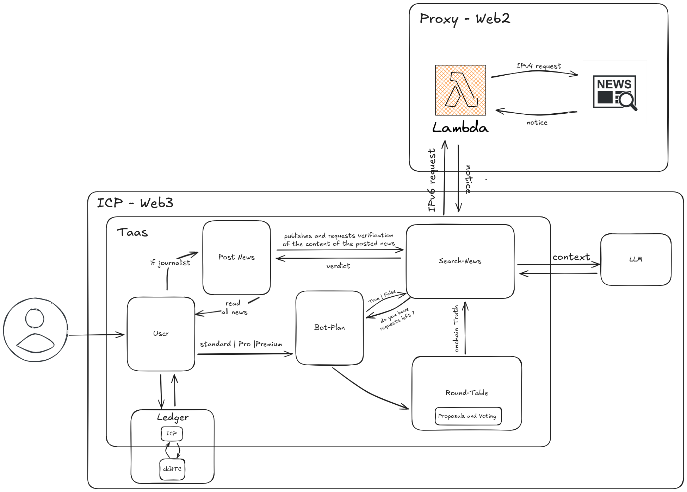
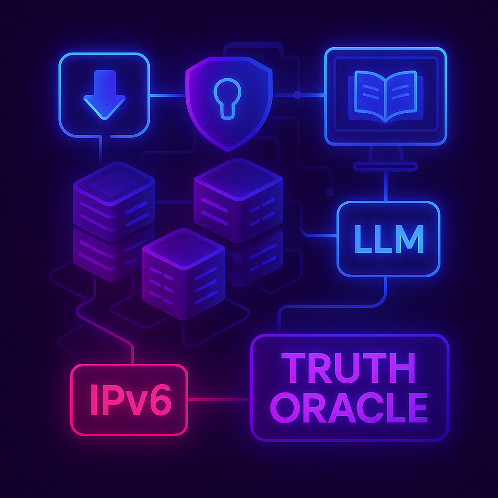
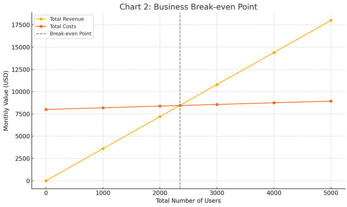

# Truth-as-a-Service | TaaS

<p align="center">
  
  
</p>

## Project Summary

[TaaS](https://5vhpn-tyaaa-aaaaf-qbija-cai.icp0.io/) is a decentralized news platform built on the [Internet Computer Protocol (ICP)](https://internetcomputer.org/) that provides security, accuracy, freedom of expression and finantial support on-chain.

It allows journalists to publish news directly on the blockchain, ensuring their content is secure and censorship-resistant. By utilizing AI-driven fact-checking, TaaS aggregates trusted sources and community input, processing information through LLMs to validate accuracy. The platform then stores the final verdicts on-chain, providing a transparent and immutable record of truth.

<p align="center">
  
</p>

It's designed to combat misinformation by creating a transparent, community-driven system for verifying claims and storing tamper-proof verdicts.

## Developers
- [Gabriel Farias](https://www.linkedin.com/in/gabriel-farias-alves/)
- [Kaiane Cordeiro](https://www.linkedin.com/in/kaiane-souza/)
- [Marco A. Rizzi](https://www.linkedin.com/in/marco-a-rizzi/)
- [Marcos Teixeira](https://www.linkedin.com/in/marcos-teixeira-37676a24a/)

## Table of Contents
- [0. Get Started](#0-get-started)
  - [0.1 Prerequisites](#01-prerequisites)
  - [0.2 Installation](#02-installation)
  - [0.3 Available Commands](#03-available-commands)
  - [0.4 Next Steps](#04-next-steps)
- [1. Business Vision](#1-business-vision)
  - [1.1 TaaS as a Trusted News Platform](#11-taas-as-a-trusted-news-platform)
  - [1.2 Empowering Journalists and Freedom of Expression](#12-empowering-journalists-and-freedom-of-expression)
  - [1.3 Core Pillars](#13-core-pillars)
  - [1.4 Brazil: National Context and Opportunities](#14-brazil-national-context-and-opportunities)
  - [1.5 Mission and Long-Term Vision](#15-mission-and-long-term-vision)
- [2. Architecture Overview](#2-architecture-overview)
  - [2.1 Search News](#21-search-news)
  - [2.2 Round Table](#21-search-news)
  - [2.3 Bot Plan](#23-round-table)
  - [2.4 Publish News]()
  - [2.5 Users]()
- [ 3. The Journey of a Query](#3-the-journey-of-a-query)
  - [3.1 User Interaction and Access Management](#31-user-interaction-and-access-management)
  - [3.2 The Core Verification Process (Core Loop)](#32-the-core-verification-process-core-loop)
  - [3.3 The Hybrid Bridge: Web3 to Web2 Interaction](#33-the-hybrid-bridge-web3-to-web2-interaction-ipv6--ipv4-proxy)
- [4. Financial Analysis](#4-financial-analysis)
  - [4.1 Subscription Plans](#41-subscription-plans)
  - [4.2. Core Financial Assumptions](#42-core-financial-assumptions)
  - [4.3 Per-User Profitability Analysis](#43-per-user-profitability-analysis)
  - [4.4 Sustainability Model: Subsidizing the Network](#44-sustainability-model-subsidizing-the-network)
  - [4.5 Case Study: Path to Profitability](#45-case-study-path-to-profitability)
  - [4.6 Data for Visualization](#46-data-for-visualization)
  - [4.7 Finantial Conclusion](#47-finantial-conclusion)

## 0. Get Started
Follow these steps to set up and run the TaaS project on Internet Computer Protocol (ICP).

### 0.1 Prerequisites

Before running the project, make sure you have the following installed:

- [DFX](https://internetcomputer.org/docs/current/developer-docs/setup/install/) - The DFINITY command-line execution environment
- [Mops](https://mops.one/) - Package manager for Motoko
- [Node.js](https://nodejs.org/) (version 16 or higher)


### 0.2 Installation

1. **Clone the repository**
   ```bash
   git clone https://github.com/Txrmarcos/TaaS.git
   cd taas
   ```

2. **Install backend dependencies (Mops packages)**
   ```bash
   mops install
   ```

3. **Install frontend dependencies**
   ```bash
   cd frontend
   npm install
   cd ..
   ```

4. **Start the local Internet Computer replica**
   ```bash
   dfx start --background
   ```

5. **Deploy the canisters**
   ```bash
   dfx deploy
   ```

## Running the Project

1. **Start the development server**
   ```bash
   dfx start
   ```

2. **In a new terminal, deploy your canisters**
   ```bash
   dfx deploy --network local
   ```

3. **Start the frontend development server**
   ```bash
   cd frontend
   npm start
   ```

4. **Access the application**
   - Frontend: `http://localhost:3000`
   - Candid Interface: `http://localhost:4943/?canisterId={canister-id}`

### 0.3 Available Commands

#### DFX Commands
- `dfx start` - Start the local Internet Computer replica
- `dfx start --clean` - Start with a clean state (removes previous data)
- `dfx start --background` - Start the replica in background mode
- `dfx stop` - Stop the local ICP replica
- `dfx build` - Compile all canisters without deploying
- `dfx build <canister-name>` - Build a specific canister
- `dfx deploy` - Build and deploy all canisters to local network
- `dfx deploy --network ic` - Deploy to the main Internet Computer network
- `dfx deploy <canister-name>` - Deploy a specific canister
- `dfx canister status` - Check the status of all canisters
- `dfx canister call <canister-name> <method>` - Call a canister method
- `dfx identity list` - List available identities
- `dfx identity use <identity-name>` - Switch to a different identity

#### Mops Commands
- `mops install` - Install all Motoko packages from mops.toml
- `mops add <package-name>` - Add a new package dependency
- `mops test` - Run tests (if configured)
- `mops sources` - Show package sources and versions

#### Frontend Commands
- `npm install` - Install frontend dependencies
- `npm start` - Start the development server
- `npm run build` - Build the frontend for production

#### Development Workflow
1. **Build Backend**: `dfx build` - Compile your canisters
2. **Deploy Backend**: `dfx deploy` - Deploy to local replica
3. **Start Frontend**: `cd frontend && npm start` - Run frontend dev server
4. **Test**: Access frontend at `http://localhost:3000`
5. **Iterate**: Make changes and repeat the process

### 0.4 Next Steps

After successfully running the project:
1. Explore the candid interface to interact with the canisters
2. Check the project documentation for API details
3. Review the source code to understand the implementation
4. Consider contributing to the project development

## 1. Business Vision
Truth-as-a-Service (TaaS) is a decentralized platform that empowers journalists to publish verified, fact-checked news directly on the blockchain. By providing real-time verification of claims through trusted, audited sources, TaaS removes uncertainty around data accuracy. The platform stores all results immutably on-chain, creating a transparent and permanent record. This offers journalists a secure and censorship-resistant environment to publish their work while providing businesses and applications with a reliable, auditable data source for decision-making.

### 1.1 TaaS as a Trusted News Platform
TaaS (Truth as a Service) is designed to create a decentralized, secure, and censorship-resistant news platform. At its core, TaaS aims to offer an ecosystem where journalists can publish their content directly onto the blockchain without the fear of being censored or silenced by centralized entities. TaaS' platform supports the free flow of truthful information, creating a sanctuary for journalists to express themselves while ensuring that readers can access unfiltered news. It’s not just a social network but a platform dedicated to on-chain freedom of expression, where the community governs and ensures that information remains untampered with.

The TaaS platform works by utilizing the power of blockchain to make news publishing and consumption more transparent and reliable. By decentralizing the ecosystem, TaaS ensures that no central authority can block or alter the information, allowing for a truly open flow of news.

#### Key Features:

* **Decentralized Publishing:** Journalists can publish directly onto the blockchain, ensuring their content is secure and censorship-resistant.
* **Censorship-Resistant:** No central entity can block, alter, or delete content, allowing for true freedom of expression.
* **On-Chain Freedom of Expression:** A platform where journalists and readers interact without interference, with all information publicly available and transparent.
* **Immutable Records:** All published content is stored permanently and transparently on the blockchain, providing a tamper-proof history.
* **Community Governance:** The platform is governed by the community, where decisions about trusted sources and content validation are made through democratic processes.
* **Transparent and Verifiable:** Provides readers with access to unfiltered, trustworthy news while ensuring the information is verified and authentic.

### 1.2 Empowering Journalists and Freedom of Expression

TaaS (Truth as a Service) empowers journalists by providing a decentralized platform where they can publish freely, without fear of censorship or retribution. In an increasingly repressive world, the ability to speak and share the truth without fear of violence, imprisonment, or death is invaluable. TaaS guarantees this freedom of expression, while also ensuring that the information journalists publish is verified and accurate, offering a balanced ecosystem for truth-telling.

In many countries, however, journalists face extreme challenges when trying to report the truth. Government censorship, tyranny, and dictatorship severely limit freedom of expression and the dissemination of information. These oppressive forces don't just censor the news—they threaten the very lives of journalists. For example:

* [**Jamala Khashoggi’s Case (2018):**](https://www.bbc.com/news/world-europe-45812399) A tragic and well-known example of the dire consequences faced by journalists occurred when **Jamala Khashoggi**, a journalist for *The Washington Post* and a vocal critic of Saudi Crown Prince Mohammed bin Salman, was killed. Khashoggi’s criticism of authoritarian power resulted in his assassination, highlighting the lethal consequences of speaking out in an oppressive regime. Documents later revealed that Prince bin Salman viewed Khashoggi as a threat to his reign and even sanctioned violent actions to silence him.

* [**Equatorial Guinea Internet Shutdown (2020):**](https://www.theguardian.com/technology/2025/mar/09/internet-shutdowns-record-high-africa-2024-access-weaponised) More recently, in **Equatorial Guinea**, the government shut down the internet to prevent the spread of information about human rights abuses during peaceful protests. These protests were sparked by environmental damage caused by explosions linked to a Moroccan infrastructure company, SOMAGEC. The government’s response, an internet shutdown, left citizens unable to document and share the truth about what was happening on the ground. It’s a reminder that even in an age of connectivity, governments can wield the power to silence their people and control information flow.

* **Global Journalist Threats:** In addition to the dangers posed by censorship, **62 journalists** were reported killed in 2020 alone, and over  **1,200 media professionals** lost their lives in the same way, according to [UNESCO](https://www.unesco.org/en/threats-freedom-press-violence-disinformation-censorship). These statistics highlight a growing trend of violence and intimidation faced by journalists globally.

In a world where censorship and repression are daily realities, the need for platforms like TaaS is more urgent than ever. TaaS ensures that journalists not only have the freedom to publish without fear but also the responsibility of accuracy, empowering them to report the truth while protecting their voices.

#### 1.2.1 Accuracy of Speech

While TaaS upholds freedom of speech, it also places a strong emphasis on the accuracy of information. To ensure that the content published is factual and reliable, TaaS implements a comprehensive verification process for every claim submitted by journalists. This process combines community-curated sources with AI-driven reasoning to validate claims, providing a transparent and immutable record on the blockchain.

The process describes the step-by-step process that ensures each piece of information remains accurate while empowering journalists to publish without fear of censorship:

* **User Interaction:** The verification process begins when the user logs in and submits their news via the FrontEnd.
* **Verification Process:** The news is sent to the `search-news` canister for verification. The canister searches for similar content on Web2 platforms to compare with the published news, using AI-driven analysis to cross-reference it with trusted sources from the community.
* **Fact-Checking:** The system interprets the information by comparing the news to similar articles. Based on this, it classifies the news as True, False, or Uncertain if no relevant content is found.
* **Final Verdict:** The result, or verdict, is sent back to the FrontEnd, providing the user with a verified, accurate response.

This process ensures that, while journalists have full freedom to express their views, the information they publish is subject to rigorous validation, maintaining a trustworthy and reliable news platform.

### 1.3 Core Pillars

[imagem dos pilares]

The platform operates on four core pillars that ensure its effectiveness in promoting and safeguarding truth:

* **Security:** The use of blockchain ensures that all data is secure, immutable, and resistant to tampering. Journalists and readers alike are assured that the content published on TaaS cannot be deleted or altered by any centralized authority.

* **Accuracy:** TaaS incorporates an on-chain verification system that ensures the authenticity of news. Each article goes through a rigorous cross-checking process using trusted news sources and AI-driven fact-checking, providing readers with transparent information on the trustworthiness of the content.

* **Freedom of Expression:** The platform guarantees freedom of speach by enabling journalists to publish their content without any fear of censorship or repression. This empowers journalists worldwide to share vital information that might otherwise be suppressed.

* **Finantial Support:** Readers have the ability to directly support journalists through donations, which provides a sustainable model for independent journalism. This support fosters a community-driven approach to journalism, where readers help ensure that quality, unbiased reporting continues to thrive.

### 1.4 Brazil: National Context and Opportunities

Brazil, with its history of political instability and censorship, provides a unique backdrop for the launch of TaaS. The country’s judicial system has previously ordered the blocking of social media accounts, threatening the freedom of information. In such an environment, TaaS represents a crucial innovation by enabling decentralized, censorship-resistant news. By leveraging TaaS, Brazilian journalists can circumvent traditional barriers, ensuring that their content is not suppressed by governmental or corporate interests.

A recent example of this issue occurred when **Alexandre de Moraes**, the Minister of the Brazilian Supreme Court, [ordered the blocking of X accounts and profiles that violated the law](https://www.theguardian.com/technology/2024/sep/19/brazil-twitter-ban-fine-musk-alexandre-de-moraes). This order imposed a hefty fine of **R\$50,000 per day** if not complied with and threatened to arrest the person in charge of the platform’s office in Brazil. Such actions highlight the increasing control over information and the risks faced by journalists and users when expressing dissenting opinions or reporting freely. In such a scenario, TaaS offers a solution by allowing content to be published in a secure and censorship-resistant environment, without fear of government overreach.

Moreover, Brazil’s diverse and vibrant media landscape presents a significant opportunity for TaaS to grow and provide value. As Brazil continues to face challenges around freedom of expression and media independence, TaaS can become a key platform for securing journalists' rights and ensuring the public’s access to the truth. By enabling decentralized news, TaaS helps protect journalists from oppressive actions and provides a safe space for them to share information without the risk of censorship or punitive measures.

### 1.5 Mission and Long-Term Vision

TaaS’s mission is to break the chains of censorship and provide a platform that guarantees total freedom of expression. It envisions a future where journalists worldwide can operate freely, without fear of repression, and where readers have unfettered access to accurate, unbiased news. TaaS strives to create an ecosystem where truth is verified and accessible, where journalists can monetize their work without dependence on advertisers or political influence, and where readers can support and contribute directly to the journalism they value.

Long-term, TaaS aims to become a global platform that transcends national borders, reaching every corner of the world where freedom of expression is under threat. By building an open, transparent, and decentralized infrastructure, TaaS is poised to revolutionize the media landscape and provide a lasting solution to the global issue of censorship.

## 2. Architecture Overview

TaaS (Truth-as-a-Service) receives user claims, fetches information from web data sources, processes reasoning through Language Models (LLMs), aggregates community input, and stores tamper-proof final verdicts.

The architecture is modular, where each logical component is a canister (smart contract) on the ICP network, promoting scalability and interoperability.

<p align="center">
  
</p>

### 2.1 Search News

The ``search-news`` canister is the central orchestrator of the verification process. Its main responsibilities are:

<p align="center">
  
</p>

-   **Receive Queries:** Acts as the entry point for claims (prompts) submitted by users or other dApps.
-   **Access Control:** Before processing a query, it checks with the ``bot-plan`` canister to see if the user has available requests in their subscription plan.
-   **Source Curation:** Queries the ``round-table`` canister to get the list of trusted and community-approved news sources. The information search is restricted to these sources.
-   **LLM Interaction:** Prepares the search context based on the approved sources and sends it to the IPC's LLM canister, which uses a language model to process the information and synthesize a logical conclusion.
-   **Bridge to Web2:** To access news sources operating on *IPv4*, search-news sends an *IPv6* request to a Proxy (e.g., AWS Lambda). The proxy translates the request to *IPv4*, collects the data from the source (e.g., newsapi.org), and returns it to the canister.
-   **Verdict Delivery:** Consolidates the result from the LLM analysis and sends it back to the FrontEnd or the requesting dApp as a final and auditable Verdict.
-   **Truth Oracle:** Being modular, any dApp can call search-news directly to integrate a fact-checking system, positioning TaaS as a trust infrastructure layer for Web3.

### 2.2 Round Table

The ``round-table`` is the canister responsible for the decentralized governance of information sources. Its function is to ensure that the TaaS knowledge base is reliable and curated by the community.

<p align="center">
  
</p>

-   **Source Governance:** Community members can create proposals and conduct voting (Proposals and Voting) to add or remove data sources (news sites, APIs, etc.).
-   **On-chain Registry:** Once a source is democratically approved, it is registered on-chain in a transparent and immutable manner.
-   **Provision of Trusted Sources:** The canister provides the list of approved sources (onchain-Truth) to the search-news canister, ensuring that only data from validated sources are used in the verification process.

### 2.3 Bot Plan

The ``bot-plan`` is the canister that manages user subscriptions, plans, and access to TaaS services.

<p align="center">
  
</p>

-   **Plan Management:** Upon logging in, the user is assigned a default plan (Standard). They can interact with the ``bot-plan`` to upgrade to higher-tier plans (Pro, Premium), which offer more requests or features.
-   **Usage Validation:** When ``search-news`` receives a request, it queries the bot-plan to validate the user's usage quota (do you have requests left?). The ``bot-plan`` then authorizes or denies the process continuation based on the active plan and consumption to date.
-   **Payment Integration:** The system uses the on-chain Ledger so that users can convert ICP tokens to ``ckBTC`` (a "wrapped" Bitcoin on the ICP network), which is the currency used for payment and plan exchanges within the application.

## 4. Financial Analysis

The analysis covers the project's revenue streams, cost structure, and the key metrics for achieving profitability and long-term sustainability.

The TaaS model is a "Freemium" service, featuring a free "Standard" plan supported by paid "Pro" and "Premium" subscribers. Revenue is generated from subscriptions, while the primary operational cost stems from the on-chain HTTP requests required for fact-checking, which consume cycles on the Internet Computer.

The model is designed to be highly sustainable, with each paying user generating sufficient profit to cover their own operational costs and subsidize a significant number of free users, enabling scalable network growth.

### 4.1 Subscription Plans

| Plan | Price (USD) | Requests per Day | Key Features | Target Audience |
| :--- | :--- | :--- | :--- | :--- |
| *Standard* | *Free* | 5 | Basic fact-checking, Access to verified news | General Users, Students |
| *Pro* | *$19.99* | 50 | Advanced fact-checking, Trend analysis, Detailed reports | Professionals, dApps |
| *Premium* | *$99.99* | 500 | Full access, Custom API, 24/7 support, Custom analysis | Enterprises, Media Orgs |

- **Payment:** Users pay for plans using ckBTC (a "wrapped" Bitcoin on ICP) or other integrated payment methods, with prices denominated in USD.
- **ICP Price (Assumption):** For context, we assume an ICP price of *$10.00 USD*. This value is used for illustrative purposes regarding cycle costs, but all calculations are kept in USD for stability.

### 4.2. Core Financial Assumptions

- *Cost per Request:* The cost of an on-chain HTTP request (outcall) to the IPv4 proxy.
  - *Cost:* *$0.0005 USD* per request.
- *Revenue Allocation:* To ensure canisters remain funded, a portion of the revenue is immediately converted to cycles.
  - *Allocation:* *50% of subscription revenue* is allocated to the cycles wallet for operational costs. The remaining 50% is considered Gross Profit before other business expenses (salaries, marketing, etc.).

## 4.3 Per-User Profitability Analysis

This analysis determines the profitability of each paying subscriber, assuming they use their maximum daily request limit over a 30-day month.

### 4.3.1 Standard Plan (Cost Center)
- *Monthly Revenue:* $0
- *Max Monthly Requests:* 5 requests/day * 30 days = 150 requests
- *Max Monthly Cost:* 150 requests * $0.0005/request = *$0.075*
- *Net Result:* A cost of *$0.075 per user per month*.

### 4.3.2 Pro Plan (Profit Center)
- *Monthly Revenue:* $19.99
- *Cycle Allocation (50%):* $9.995
- *Max Monthly Requests:* 50 requests/day * 30 days = 1,500 requests
- *Max Monthly Cost:* 1,500 requests * $0.0005/request = *$0.75*
- *Gross Profit (after request costs):* $19.99 (Revenue) - $0.75 (Cost) = *$19.24*
- *Analysis:* Highly profitable. The allocated $9.995 in cycles easily covers the maximum possible cost of $0.75.

### 4.3.3 Premium Plan (Profit Center)
- *Monthly Revenue:* $99.99
- *Cycle Allocation (50%):* $49.995
- *Max Monthly Requests:* 500 requests/day * 30 days = 15,000 requests
- *Max Monthly Cost:* 15,000 requests * $0.0005/request = *$7.50*
- *Gross Profit (after request costs):* $99.99 (Revenue) - $7.50 (Cost) = *$92.49*
- *Analysis:* Extremely profitable. A single Premium user generates a significant surplus.

## 4.4 Sustainability Model: Subsidizing the Network

The key to sustainability is understanding how many free users each paying user can support.

- *Cost to support 1 Standard User:* *$0.075 per month*.
- *Gross Profit from 1 Pro User:* *$19.24 per month*.
- *Gross Profit from 1 Premium User:* *$92.49 per month*.

### Sustainability Ratio:
- *Pro User:* $19.24 / $0.075 ≈ *1 Pro user can support the request costs of ~256 Standard users.*
- *Premium User:* $92.49 / $0.075 ≈ *1 Premium user can support the request costs of ~1,233 Standard users.*

This demonstrates a robust model where a small percentage of paying users can sustain a very large base of free users.

## 4.5 Case Study: Path to Profitability

Let's model the business with fixed operational costs (salaries, marketing, etc.) to find the break-even point.

*Assumptions:*
- *Fixed Monthly Costs:* *$8,000 USD*
- *User Base Distribution:* A typical "freemium" split:
    - 90% Standard users
    - 8% Pro users
    - 2% Premium users

### Scenario Analysis

| Total Users | Standard Users (90%) | Pro Users (8%) | Premium Users (2%) | Total Revenue | Total Request Costs | Gross Profit | Net Profit/Loss |
| :--- | :--- | :--- | :--- | :--- | :--- | :--- | :--- |
| *1,000* | 900 | 80 | 20 | $3,599 | $187.50 | $3,411.50 | *-$4,588.50* |
| *2,000* | 1,800 | 160 | 40 | $7,198 | $375.00 | $6,823.00 | *-$1,177.00* |
| *2,500* | 2,250 | 200 | 50 | $8,997.50 | $468.75 | $8,528.75 | *$528.75* |
| *5,000* | 4,500 | 400 | 100 | $17,995 | $937.50 | $17,057.50 | *$9,057.50* |
| *10,000* | 9,000 | 800 | 200 | $35,990 | $1,875.00 | $34,115.00 | *$26,115.00* |

*Break-Even Point:* The business becomes profitable (covers its fixed costs) with approximately *2,350 total users* under this distribution model.

## 4.6 Data for Visualization

### Graph 1: Business Break-Even Point
This graph shows the total revenue and total costs as the user base grows. The intersection is the break-even point.

*X-Axis:* Total Number of Users
*Y-Axis:* Monthly Amount (USD)

<p align="center">
  
</p>

*Data Table:*
| Total Users (X) | Total Revenue | Total Costs (Requests + $8k Fixed) |
| :--- | :--- | :--- |
| 0 | $0 | $8,000 |
| 1,000 | $3,599 | $8,187.50 |
| 2,000 | $7,198 | $8,375.00 |
| *2,350* | *$8,457.65* | *$8,440.63* |
| 3,000 | $10,797 | $8,562.50 |
| 4,000 | $14,396 | $8,750.00 |
| 5,000 | $17,995 | $8,937.50 |

## 4.7 Finantial Conclusion

The financial model for TaaS is demonstrably robust and commercially viable. The analysis reveals several key strategic insights:

1.  *High Profit Margins:* The Pro and Premium plans are exceptionally profitable, with revenue far exceeding the variable costs associated with user requests. This core profitability is the engine of the entire business.

2.  *Sustainable Freemium Model:* The free Standard plan, while a direct cost, is a critical driver for user acquisition and network effect. The model proves that a small conversion rate to paid plans (e.g., a combined 10%) is more than sufficient to subsidize a large free user base, making growth sustainable.

3.  *Clear Path to Profitability:* The break-even analysis provides a clear target. With fixed costs of $8,000 per month and a typical user distribution, profitability is achieved at approximately 2,350 total users. This is a tangible and achievable goal for an early-stage project.

4.  *Scalable and Efficient:* The model scales effectively. Once fixed costs are covered, a significant portion of revenue from new paying users contributes directly to net profit, allowing for reinvestment into growth and development.

In summary, the TaaS business model is well-structured for success in the Web3 space. The primary strategic focus should be on *demonstrating the value of Pro/Premium features* to encourage user conversion and on *attracting enterprise clients* for the Premium tier, as they provide the largest boost to revenue and long-term stability.