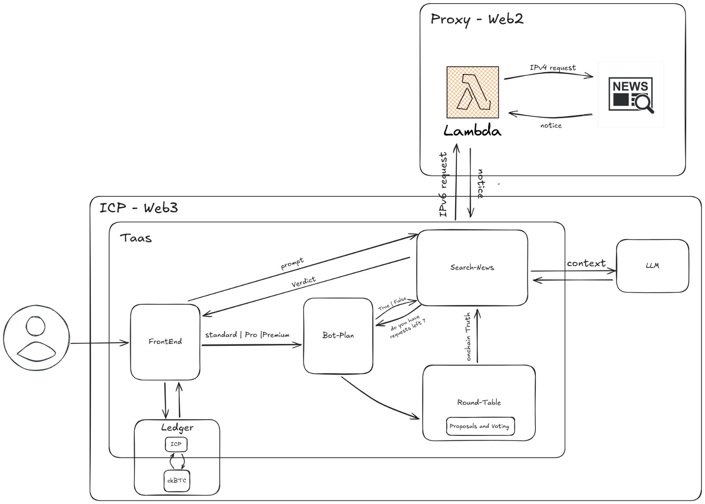

# Visão Geral

&emsp;TaaS (Truth-as-a-Service) é um protocolo descentralizado construído na blockchain da Internet Computer (ICP) que oferece um serviço de verificação de fatos de forma rápida, auditável e on-chain. A solução recebe alegações de usuários, busca informações em fontes de dados na web, processa o raciocínio através de Modelos de Linguagem (LLMs), agrega o input da comunidade e armazena vereditos finais à prova de violação.

&emsp;A arquitetura é modular, onde cada componente lógico é um canister (smart contract) na rede ICP, promovendo escalabilidade e interoperabilidade.

## Fluxo Detalhado do Diagrama

  

&emsp;O diagrama ilustra a jornada completa de uma consulta dentro do ecossistema TaaS, desde a interação do usuário até a entrega de um veredito final, destacando a sinergia entre os componentes on-chain (Web3) e um proxy para acesso à Web2.

### Interação do Usuário e Gerenciamento de Acesso

&emsp;O fluxo inicia com o Usuário, que interage com a plataforma através do FrontEnd.

    Autenticação e Planos: O usuário realiza o login e, por padrão, é associado a um plano Standard. Ele pode interagir com o canister bot-plan para gerenciar sua assinatura, fazendo upgrade para planos Pro ou Premium.

    Gestão de Fundos: Através do Ledger on-chain, o usuário pode converter tokens ICP para ckBTC (um Bitcoin "wrapped" na rede ICP), que é utilizado para pagamentos dentro da aplicação, como a troca de planos.

### O Processo Central de Verificação (Core Loop)

&emsp;Uma vez configurado, o usuário pode submeter uma alegação ou pergunta ("prompt") através do FrontEnd para o serviço principal, o search-news. Este canister atua como o orquestrador central do processo de verificação.

    Controle de Uso (bot-plan ↔ search-news):

        Antes de processar a consulta, o search-news verifica com o bot-plan se o usuário possui requisições disponíveis em seu plano (do you have requests left?).

        O bot-plan valida a cota de uso (baseada em Time | Fakes ou outras métricas), autorizando ou negando a continuidade do processo.

    Curadoria de Fontes (Round-Table → search-news):

        O canister search-news não busca informações em toda a internet, mas apenas em fontes de notícias previamente aprovadas pela comunidade.

        O Round-Table é o canister responsável por essa governança. Nele, os membros da comunidade podem fazer Propostas e Votações (Proposals and Voting) para incluir novas fontes de dados confiáveis.

        Uma vez que uma fonte é aprovada democraticamente, ela é registrada on-chain. O Round-Table fornece essa lista de fontes confiáveis (onchain-Truth) para o search-news, garantindo que a base de conhecimento seja descentralizada e orgânica.

    Análise e Raciocínio (search-news ↔ LLM):

        Com a lista de fontes aprovadas em mãos, o search-news prepara o context da busca.

        Esse contexto é enviado ao canister LLM, que utiliza um modelo de linguagem para processar a informação, entender a alegação do usuário, e sintetizar uma conclusão lógica e humanizada a partir dos dados coletados.

    Entrega do Veredito (search-news → FrontEnd):

        Após a análise do LLM, o search-news consolida o resultado final e o envia de volta para o FrontEnd como um Verdict (Veredito). Este veredito é a resposta final apresentada ao usuário.

### A Ponte Híbrida: Interação Web3 com Web2 (Proxy - Web2)

&emsp;Uma parte crucial e inovadora da arquitetura é como o TaaS, rodando em um ambiente Web3, acessa dados da Web2 tradicional.

    O Desafio: A rede ICP opera nativamente com o protocolo IPv6. No entanto, a grande maioria dos sites e fontes de notícias na internet ainda opera em IPv4.

    A Solução: Para contornar essa limitação, o canister search-news não faz a requisição diretamente à fonte de notícias.

        Ele envia uma IPV6 request para um Proxy que roda em um ambiente Web2 (como uma função Lambda na AWS).

        A Lambda recebe essa requisição, a traduz e executa uma IPV4 request para o site de notícias (newsapi.org) alvo.

        Após coletar (fazer o parse) das informações, a Lambda envia uma notificação (notice) de volta para o canister search-news com os dados coletados.

&emsp;Essa abordagem híbrida permite que o sistema on-chain utilize de forma segura e eficiente a vasta gama de informações disponíveis na web tradicional.

## TaaS como um "Oráculo de Veracidade"

&emsp;O foco na integração dos canisters revela o verdadeiro potencial do TaaS: servir como uma camada de veracidade para outros dApps.

&emsp;Enquanto o diagrama mostra um fluxo iniciado por um usuário no FrontEnd, a arquitetura modular permite que qualquer outro dApp (uma rede social descentralizada, um mercado de previsões, etc.) faça uma chamada de contrato diretamente ao canister search-news.

Nesse cenário:

    Um dApp envia uma consulta (um "prompt") programaticamente.

    O TaaS executa todo o seu pipeline interno: validação de fontes via Round-Table, busca via Proxy, raciocínio via LLM.

    O TaaS retorna um veredito criptograficamente assinado e auditável diretamente para o dApp solicitante.

&emsp;Isso posiciona o TaaS não apenas como uma aplicação final, mas como uma peça fundamental de infraestrutura Web3 – um oráculo de veracidade que outros projetos podem integrar para trazer uma camada de confiança e checagem de fatos aos seus próprios ecossistemas. As características chave como verificação transparente e histórico de aprovação de fontes tornam cada resultado totalmente rastreável e confiável para uso on-chain.